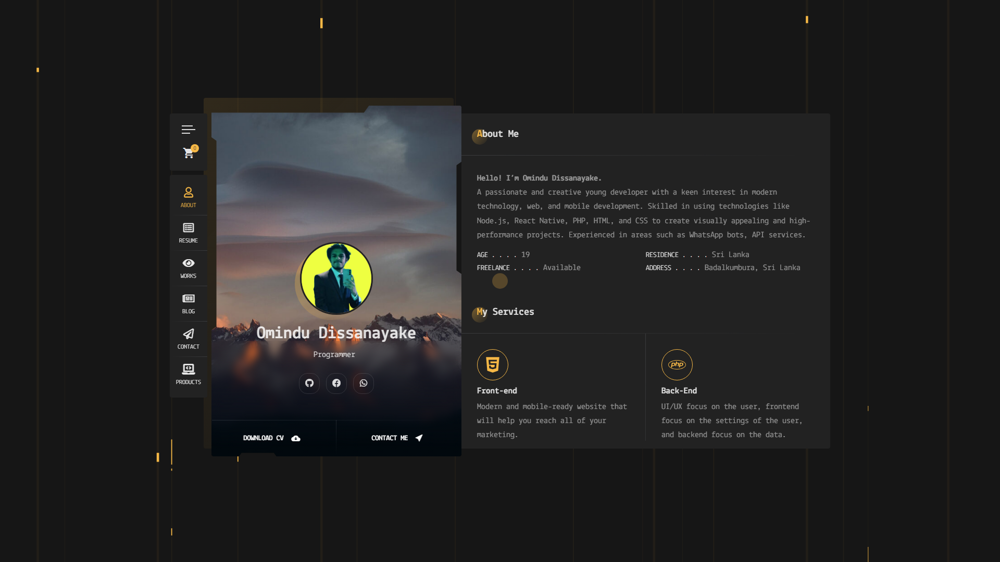

# 📸 web-screenshot-node-api


A powerful Node.js API for high-quality website screenshots with advanced customization, responsive testing, and smart ad-blocking.

## ✨ Features

- 📱 **Responsive Screenshots**: Capture across multiple devices (desktop, laptop, tablet, mobile)
- 🛡️ **Smart Ad Blocking**: Block ads while preserving icons, logos, and essential visual elements
- 🔐 **Security Bypass**: Multiple levels of bot detection bypass (low, medium, high)
- ⚡ **Performance Optimized**: Intelligent resource blocking for faster screenshots
- 🎯 **Advanced Targeting**: Wait for elements, scroll to sections, hide unwanted content
- 📊 **Comparison Testing**: A/B testing with multiple URLs
- 📋 **Detailed Reports**: Generate comprehensive screenshot reports with metadata
- 🖼️ **Multiple Formats**: Support for PNG, JPEG, and WebP formats
- ⚙️ **Highly Configurable**: Extensive customization options

## 📦 Installation

```bash
npm install web-screenshot-node-api
```

## 🚀 Quick Start

```javascript
const { webss } = require('web-screenshot-node-api');

// Basic screenshot
const result = await webss('https://omindu.dev/');
console.log('Screenshot saved:', result.path);

// Advanced screenshot with options
const result = await webss('https://omindu.dev/', {
  device: 'mobile',
  blockAds: true,
  fullPage: true,
  format: 'jpeg',
  quality: 90
});
```

## 📖 API Reference

### `webss(url, options)`

Take a screenshot of a website with advanced customization options.

**Parameters:**
- `url` (string, required): The URL to screenshot
- `options` (object, optional): Screenshot configuration

**Options:**
```javascript
{
  device: 'desktop',           // Device type: 'desktop', 'laptop', 'tablet', 'mobile', 'mobile_large'
  path: './screenshot.png',    // Output file path (auto-generated if not provided)
  fullPage: true,              // Take full page screenshot
  securityBypass: 'never',     // Security bypass level: 'never', 'low', 'medium', 'high'
  timeout: 30000,              // Page load timeout in milliseconds
  quality: 90,                 // JPEG quality (10-100)
  format: 'png',               // Image format: 'png', 'jpeg', 'webp'
  blockAds: false,             // Enable smart ad blocking
  blockImages: false,          // Block non-essential images for faster loading
  waitForSelector: null,       // Wait for specific element before screenshot
  scrollToElement: null,       // Scroll to element before screenshot
  hideElements: [],            // Array of CSS selectors to hide
  captureArea: null            // Capture specific area: { x, y, width, height }
}
```

**Returns:** Promise that resolves to:
```javascript
{
  success: true,
  path: 'd:\\web-screenshort-node-api\\screenshot-omindu.dev-desktop-a2589a2f-1757166725733.png',
  url: 'https://omindu.dev',
  device: 'desktop',
  metadata: {
    title: 'Home - Omindu Dissanayaka',
    description: 'Hi, I’m Omindu Dissanayaka, a 19-year-old developer from Sri Lanka with a passion for web, mobile, and API development.',
    viewport: { width: 1920, height: 1080 },
    scrollHeight: 1080,
    loadTime: 33712.30000000028,
    processingTime: 34416,
    fileSize: 308543,
    format: 'png',
    timestamp: '2025-09-06T13:52:40.150Z'
  }
}
```
### `Screen Short (Output)`


### `reswebss(url, options)`

Take screenshots across multiple devices for responsive testing.

```javascript
const { reswebss } = require('web-screenshot-node-api');

const results = await reswebss('https://omindu.dev/', {
  devices: ['desktop', 'tablet', 'mobile'],
  outputDir: './responsive',
  blockAds: true,
  concurrent: false  // Set to true for faster parallel execution
});
```

### `comwebss(urls, options)`

Take comparison screenshots for A/B testing.

```javascript
const { comwebss } = require('web-screenshot-node-api');

const results = await comwebss([
  'https://site-a.com',
  'https://site-b.com'
], {
  device: 'desktop',
  outputDir: './comparisons',
  blockAds: true
});
```

### `genreport(results, outputPath)`

Generate a detailed JSON report from screenshot results.

```javascript
const { genreport } = require('web-screenshot-node-api');

const reportPath = await genreport(results, './screenshot-report.json');
```

### `getDevicePresets()`

Get available device configurations.

```javascript
const { getDevicePresets } = require('web-screenshot-node-api');

const devices = getDevicePresets();
console.log(devices);
// Returns object with device configurations
```

## 🎯 Usage Examples

### Basic Screenshots

```javascript
const { webss } = require('web-screenshot-node-api');

// Simple desktop screenshot
await webss('https://github.com');

// Mobile screenshot with ad blocking
await webss('https://news.ycombinator.com', {
  device: 'mobile',
  blockAds: true
});

// High-quality JPEG
await webss('https://omindu.dev/', {
  format: 'jpeg',
  quality: 95,
  fullPage: false
});
```

### Advanced Screenshots

```javascript
// Wait for content and hide elements
await webss('https://spa-website.com', {
  waitForSelector: '.main-content',
  hideElements: ['.popup', '.cookie-banner', '.ads'],
  scrollToElement: '.important-section',
  timeout: 60000
});

// Capture specific area
await webss('https://dashboard.example.com', {
  captureArea: { x: 0, y: 0, width: 800, height: 600 },
  device: 'desktop'
});

// Bypass security with high-level settings
await webss('https://protected-site.com', {
  securityBypass: 'high',
  timeout: 45000
});
```

### Responsive Testing

```javascript
const { reswebss } = require('web-screenshot-node-api');

// Test across all devices
const results = await reswebss('https://my-website.com', {
  blockAds: true,
  concurrent: true,
  outputDir: './responsive-test'
});

console.log(`Screenshots taken: ${results.length}`);
results.forEach(result => {
  if (result.success) {
    console.log(`✅ ${result.device}: ${result.path}`);
  } else {
    console.log(`❌ ${result.device}: ${result.error}`);
  }
});
```

### A/B Testing

```javascript
const { comwebss, genreport } = require('web-screenshot-node-api');

const urls = [
  'https://site.com/version-a',
  'https://site.com/version-b'
];

const results = await comwebss(urls, {
  device: 'desktop',
  blockAds: true,
  outputDir: './ab-test'
});

// Generate detailed report
await genreport(results, './ab-test-report.json');
```

### Batch Processing

```javascript
const websites = [
  'https://github.com',
  'https://stackoverflow.com',
  'https://dev.to'
];

for (const url of websites) {
  try {
    const result = await webss(url, {
      device: 'desktop',
      blockAds: true,
      timeout: 30000
    });
    console.log(`✅ ${url}: ${result.path}`);
  } catch (error) {
    console.error(`❌ ${url}: ${error.message}`);
  }
}
```

## 📱 Device Presets

| Device | Width | Height | User Agent | Mobile |
|--------|-------|---------|------------|---------|
| `desktop` | 1920 | 1080 | Chrome Desktop | No |
| `laptop` | 1366 | 768 | Chrome Desktop | No |
| `tablet` | 768 | 1024 | iPad Safari | Yes |
| `mobile` | 375 | 812 | iPhone Safari | Yes |
| `mobile_large` | 414 | 896 | iPhone Safari | Yes |

## 🔐 Security Bypass Levels

- **`never`**: No bypass attempts (default)
- **`low`**: Basic CAPTCHA and popup bypass
- **`medium`**: Enhanced bot detection bypass
- **`high`**: Aggressive bypass for heavily protected sites

## 🛡️ Smart Ad Blocking

The intelligent ad blocking system:
- ✅ **Preserves**: Favicons, logos, brand images, essential fonts
- ❌ **Blocks**: Ad networks, trackers, popup scripts, intrusive content
- 🧠 **Smart**: Distinguishes between ads and legitimate content

## ⚙️ Configuration

### Environment Variables

```bash
# Optional: Set default timeout
SCREENSHOT_TIMEOUT=30000

# Optional: Set default output directory
SCREENSHOT_OUTPUT_DIR=./screenshots
```

### Error Handling

```javascript
try {
  const result = await webss('https://omindu.dev/', {
    timeout: 10000
  });
  console.log('Success:', result.path);
} catch (error) {
  console.error('Screenshot failed:', error.message);
  
  // Handle specific error types
  if (error.message.includes('timeout')) {
    console.log('Try increasing the timeout value');
  }
}
```

## 🔧 Advanced Configuration

### Custom Browser Arguments

The package uses optimized Puppeteer settings by default, but you can extend functionality by forking and modifying the browser launch arguments in the source code.

### Resource Blocking Patterns

You can access and modify the blocking patterns:

```javascript
const { AD_BLOCK_PATTERNS } = require('web-screenshot-node-api');
console.log('Blocked patterns:', AD_BLOCK_PATTERNS);
```

## ⚡ Performance Tips

1. **Use `concurrent: false`** for responsive screenshots on limited resources
2. **Enable `blockImages: true`** for faster screenshots when images aren't needed
3. **Set appropriate `timeout`** values based on site complexity
4. **Use `captureArea`** instead of `fullPage` for specific sections
5. **Enable `blockAds`** to reduce load time and improve performance

## 🐛 Troubleshooting

### Common Issues

**"Navigation timeout exceeded"**
```javascript
// Increase timeout for slow sites
await webss(url, { timeout: 60000 });
```

**"Failed to launch browser"**
```bash
# Install missing dependencies (Linux)
sudo apt-get install -y gconf-service libasound2 libatk1.0-0 libc6 libcairo2
```

**"Screenshot too large"**
```javascript
// Use viewport screenshot instead of full page
await webss(url, { fullPage: false });
```

### Debug Mode

Enable verbose logging by setting the environment variable:
```bash
DEBUG=true node your-script.js
```

## 🤝 Contributing

Contributions are welcome! Please feel free to submit a Pull Request.

1. Fork the repository
2. Create your feature branch (`git checkout -b feature/AmazingFeature`)
3. Commit your changes (`git commit -m 'Add some AmazingFeature'`)
4. Push to the branch (`git push origin feature/AmazingFeature`)
5. Open a Pull Request

## 📄 License

This project is licensed under the GPL-3.0 License - see the [LICENSE](LICENSE) file for details.

## 📞 Support

If you encounter any issues or have questions:

1. Check the [troubleshooting section](#-troubleshooting)
2. Search [existing issues](https://github.com/OminduDissanayaka/web-screenshot-node-api/issues)
3. Create a [new issue](https://github.com/OminduDissanayaka/web-screenshot-node-api/issues/new)

---

## 👨‍💻 Author

**Omindu Dissanayaka**
- GitHub: [@OminduDissanayaka](https://github.com/OminduDissanayaka)

Happy screenshotting! 📸